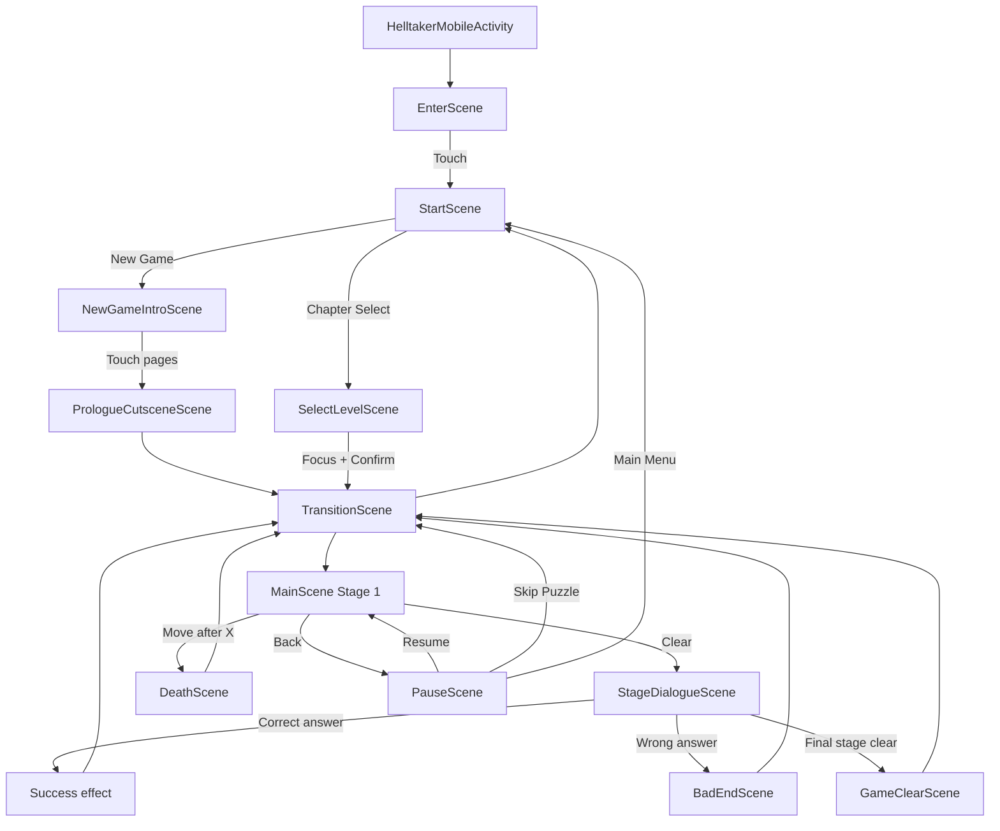

# HELLTAKER MOBILE

## 게임 소개

**게임 컨셉**
 - 퍼즐 게임인 HEELTAKER 모작(모바일 버전)

 - 정해진 횟수 내에 목표에 도달하면 클리어

 - 플레이어는 상하좌우로 이동 가능하며 장애물을 파괴하거나 밀어서 목표까지 도달해야 한다.
   
**개발 범위**
  1. game framework 구현
  2. ~~TileMap Editor 구현~~
  3. Image Resource Sheet, Stage data file, SceneGameObject Layering, Score / Font Drawing 활용

**예상 게임 실행 흐름**

# 개발 계획/일정/실제 진행

**개발 일정 및 계획**
| 주차 | 기간 | 계획 |
|--|--|--|
| 1주차 | 4월 6일 ~ 4월 12일 | Game Resource 수집 | 
| 2주차 | 4월 13일 ~ 4월 19일 | GameFrameWork 제작 1 |
| 3주차 | 4월 20일 ~ 4월 26일 | GameFrameWork 제작 2 |
| 4주차 | 4월 27일 ~ 5월 3일 | Game 핵심 로직 구현 및 GameObject 제작 |
| 5주차 | 5월 4일 ~ 5월 10일 | Stage 1 2 3 구현 |
| 6주차 | 5월 11일 ~ 5월 17일 | 중간 점검 및 미구현 항목 보완 |
| 7주차 | 5월 18일 ~ 5월 24일 | 사운드, 애니메이션 추가 및 시작 화면 제작 |
| 8주차 | 5월 25일 ~ 5월 31일 | Project 점검 및 보완 |
| 9주차 | 6월 1일 ~ 6월 7일 | 디테일 점검 및 추가적인 스테이지 추가 |
| 10주차 | 6월 8일 ~ 6월 14일 | 최종 점검 및 완성 |

**현재까지의 진행 상황**
| 주차 | 진행 상황 | 진행율 |
|--|--|--|
| 1주차 | Game Resource 수집 | 100% |
| 2~3주차 | GameFrameWork 제작 | 100% |
| 4주차 | Game 로직 구현 및 Object 제작 | 100% |
| 5주차 | Stage 1~3 구현 | 100% |
| 6주차 | 스테이지 오브젝트 배치 수정 | 100% |
| 7주차 | 사운드, 애니메이션 추가 및 시작 화면 제작 | 100% |
| 8주차 | Project 점검 및 스테이지 연결 보완 | 100% |
| 9주차 | 디테일 점검 및 4~8 스테이지 추가 | 100% |
| 10주차 | 최종 점검 및 완성 | 100% |

**변경된 점**
  * 개발 계획 부분
    * 5주차의 TileMapEditor 구현 -> Stage 1 2 3 구현 
    * 6주차의 Stage 1 2 3 구현 -> 중간 점검 및 미구현 항목 보완
    
  * 개발 부분
    * 스테이지 개수 추가
    * 컷신 추가
    * 스테이지 전환 장면 추가

**git commit 자료**

# 게임 구성 및 구조

**Activity 구성**
  - HelltakerAcitvity 만 사용

**Scene 구성 및 전환 관계**

| Scene | 핵심 역할 |
|---|---|
| `EnterScene` | 첫 시작 화면의 문구와 배경, 사운드를 재생 |
| `StartScene` | 시작 메뉴 표시 |
| `SelectLevelScene` | 8개 챕터 버튼과 Exit를 배치 |
| `NewGameIntroScene` | 새 게임 진행 시 컷신 재생 |
| `PrologueCutsceneScene` | 프롤로그 컷신 재생 |
| `TransitionScene` | 전환용 컷신 재생 및 다음 스테이지 리소스 로드 |
| `MainScene` | 리소스, 객체 로드, 이동 규칙, 충돌, 클리어 및 사망 판정 담당 |
| `PauseScene` | 설정창 기능 담당 |
| `StageDialogueScene` | 정답 선택 시 애니메이션 재생 후 다음 스테이지로 이동 |
| `BadEndScene` | 오답 선택 시 애니메이션 재생 후 현재 스테이지로 복귀 |
| `DeathScene` | 사망 애니메이션 재생 담당 |
| `GameClearScene` | 엔딩 페이지 랜더링 담당 |

**class 구성 정보**
  - Game Object

| 클래스 | 정보 |
|---|---|
| `StageBackground` | 스테이지 배경 랜더링 담당 |
| `StagePlayer` | Idle, 이동, 발차기, 피격, 이동 표현 |
| `StageProp` | 해골, 돌 Idle, 밀림, 피격, 제거 상태 및 이동 표현 담당 |
| `StageWaveSpike` | 턴마다 활성/비활성 상태가 적용되는 가시 프레임 |
| `StageTorch` | 횃불 잔과 불꽃 프레임 |
| `StageFloatingSprite` | 하트 이미지 랜더링 담당 |
| `StageHud` | 좌우 장식, 이동 횟수, Restart, 방향키 |
| `StageEffect` | 각종 이펙트 랜더링 담당 |

  - Controller와 데이터

| 클래스 | 정보 |
|---|---|
| `StageEffectController` | 이펙트의 생성과 완료 객체 제거 전담 |
| `StageDataLoader` | 스테이지 데이터를 읽어 오브젝트 위치 지정 |
| `StageCatalog` | 스테이지 순서, 배경, 대사, 선택지, 정답/오답 결과 보관 |
| `StageAssets` | 오브젝트 및 컷신 애니메이션 리소스 목록 관리 |
| `StageVisualConfig` | 돌, 열쇠, 상자 스케일과 횃불 태그별 오프셋 관리 |
| `StageLayer` | `BG -> TILE -> SPIKE -> OBJECT -> CHARACTER -> PLAYER -> EFFECT -> UI` 렌더링 순서 정의 |

**상호작용 정보**

1. 이동 가능한 빈 칸은 이동 시 횟수 1 감소
2. 돌은 빈 칸으로만 밀린다. 열쇠나 가시가 있는 칸과 겹칠 수 있다.
3. 해골은 빈 칸으로 밀리고 벽, 가시 칸(활성화)이나 다른 객체에 막히면 파괴된다.
4. 해골이 비활성화 가시 위에 있으면 가시가 활성화되는 턴에 파괴된다.
5. 고정 가시는 기본 이동 1과 가시 피해 1을 합쳐 이동 횟수를 2 감소시킨다.
6. 열쇠를 획득하면 잠긴 상자를 열 수 있다.
7. 목표에 상하좌우 한 칸 내 진입 시 스테이지 클리어 대화로 이동한다.
11. 이동 횟수가 `X`가 되면 다음 이동 시 움직이지 않고 현재 위치에서 사망한다.

**UX 진행 방법**
- Enter 화면: 화면 아무 곳이나 터치해 진행
- 대사 및 컷신: 터치할 때마다 다음 페이지로 이동
- 메뉴와 선택지: 첫 터치로 `focus`, 같은 항목 두 번째 터치로 확정
- 퍼즐: 상하좌우 버튼으로 이동
- Restart: 첫 터치로 `focus`, 두 번째 터치로 현재 스테이지 다시 시작
- 뒤로가기: 퍼즐에서 PauseScene(설정창)을 열고 다시 누르면 복귀
- Skip Puzzle: 다음 스테이지 이동
- Chapter Select: 1~8 스테이지 중 하나를 선택해 바로 진입

**사용된 기술**
- a2dg framework
- SceneStack / World / Layer 구조
- CSV 기반 스테이지 데이터

**참고한 것들**
- Helltaker 원작 게임 화면과 플레이 영상
- Helltaker 원작 게임 Texture2D 및 Audio 자료
- `spgp_2026`의 예제 프로젝트

**수업내용에서 차용한 것**
- `BaseGameActivity`와 `GameView`
- `Scene`, `SceneStack`, `World`
- Layer 기반 update/draw 순서
- `IGameObject`, `ITouchable`, `IRecyclable`
- 가상 좌표계와 화면 좌표 변환
- Bitmap/Sound 자원 관리 구조
- Scene push/pop/change 전환 방식

**직접 개발한 것**
- Enter, Start, Chapter Select, 설정, 프롤로그, 전환, 사망, 엔딩 Scene
- 모바일 2회 터치 포커스 UX
- 버튼 식 이동
- 플레이어와 오브젝트 간 상호작용
- 각종 이펙트 효과

## 아쉬운 점
**하고 싶었지만 못 한 것들**
- 타일 에디터 미구현

**(앱을 스토어에 판다면) 팔기 위해 보충할 것들**
- 원작 저작권자의 정식 허가와 독자 에셋 교체
- 개인정보 처리방침과 스토어 등록 자료
- 세이브 데이터와 챕터 잠금 해제

**결국 해결하지 못한 문제/버그**
  - ~~스테이지 4의 벽 뚫기 버그~~

## 수업에 대한 내용

**이번 수업에서 기대한 것, 얻은 것, 얻지 못한 것**
  - 기대한 점: 새로운 언어로 프로그래밍을 배우는 것
  - 얻은 점 : 코틀린으로 스마트폰 어플을 개발하고 실제 플레이 가능한 앱을 완성시킨 경험
  - 얻지 못한 점 : 코틀린의 다양한 기능을 활용하지 못한 점

**더 좋은 수업이 되기 위해 변화할 점**
  - 직접 코드를 치면서 하는 수업의 비중이 높았으면 좋겠습니다.
